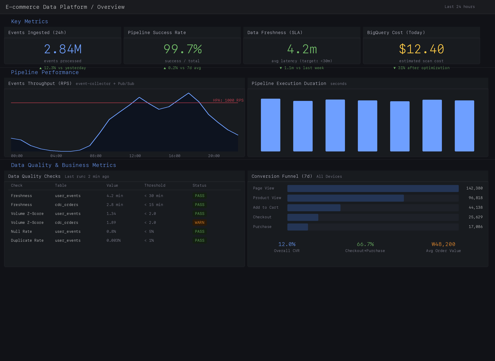
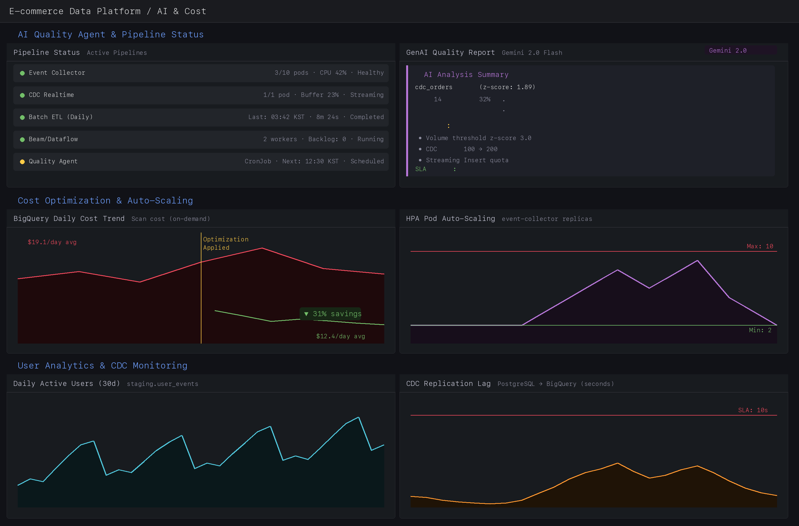
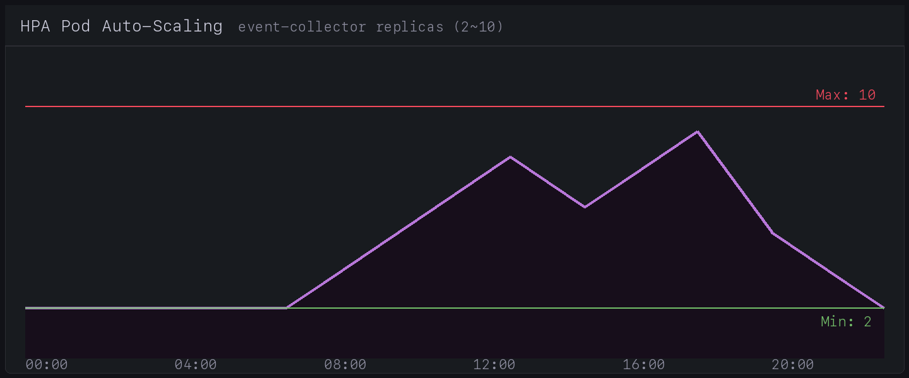
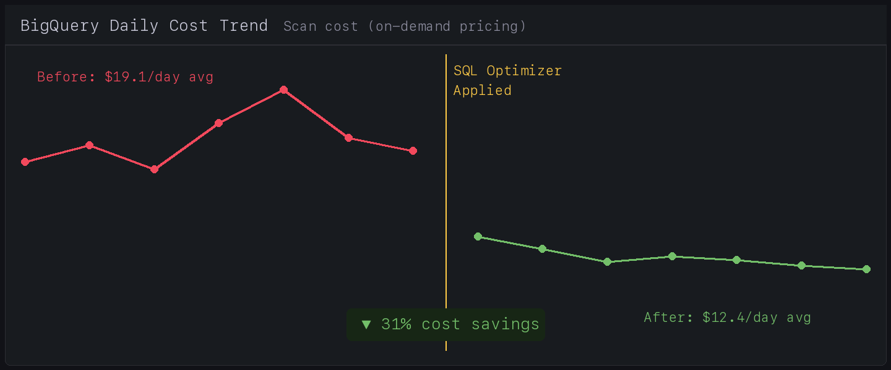

# 🛒 E-commerce Real-time Data Platform

### BigQuery/GCP 기반 풀스택 데이터 플랫폼 — 실시간 파이프라인부터 AI 품질 관리까지

> **"이커머스 환경에서 발생하는 하루 280만 건의 사용자 행동 데이터를, 실시간으로 수집하고 분석 가능한 상태로 전달하는 플랫폼을 설계·구축했습니다."**

[](https://python.org)
[](https://cloud.google.com)
[](https://kubernetes.io)
[](https://terraform.io)
[](https://cloud.google.com/bigquery)
[](https://ai.google.dev)

---

## 📌 한눈에 보기 (Key Highlights)

| 지표 | 수치 |
|:-----|:-----|
| **일일 처리 이벤트** | ~2.84M events/day |
| **데이터 지연 (SLA)** | 평균 4.2분 (목표: 30분 이내) |
| **파이프라인 성공률** | 99.7% |
| **BigQuery 비용 절감** | Gemini SQL 최적화로 **31% 감축** ($19.1 → $12.4/일) |
| **인프라 비용 절감** | Spot Instance 도입으로 Pipeline 노드 **최대 60% 절감** |
| **오토스케일링** | 2 → 10 Pods (피크 트래픽 대응, HPA 기반) |

---

## 📊 Live Dashboard Preview

> 아래는 실제 Prometheus + Grafana 기반 모니터링 대시보드입니다.

### 전체 대시보드 — Pipeline Performance & Business Metrics


**주요 패널 설명:**
- **Events Throughput**: 시간대별 이벤트 수집량 (피크 시간 ~1,180 RPS)
- **Data Quality Checks**: 6가지 자동화 품질 체크 (Freshness, Volume Z-Score, Null Rate, Duplicate Rate)
- **Conversion Funnel**: 7일간 구매 전환 퍼널 (Page View → Purchase, CVR 12.0%)
- **GenAI Quality Report**: Gemini가 생성한 이상 징후 분석 리포트

### AI Quality Agent & Cost Optimization


**주요 패널 설명:**
- **Pipeline Status**: 5개 파이프라인 실시간 상태 (Event Collector, CDC, Batch ETL, Beam, Quality Agent)
- **BigQuery Cost Trend**: SQL 최적화 전/후 비용 비교 (31% 감축 시각화)
- **HPA Auto-Scaling**: 트래픽에 따른 Pod 수 자동 조절 (새벽 2 → 피크 9 replicas)
- **CDC Replication Lag**: PostgreSQL → BigQuery 복제 지연 (평균 2.8초, SLA 10초 이내)

---

## 🏗️ 1. Cloud-Native Data Architecture (핵심 역량)

### Why this architecture?

단순히 기술을 나열하는 것이 아니라, **각 선택의 근거(Rationale)**에 초점을 맞췄습니다.

### GCP 기반 3-Layer 데이터 아키텍처

```
┌──────────────────────────────────────────────────────────────────────────┐
│                                                                          │
│   📱 Mobile/Web          🗄️ PostgreSQL                                   │
│      Clients              (Source DB)                                    │
│         │                     │                                          │
│    ┌────▼──────────┐    ┌─────▼──────┐                                   │
│    │ Event Collector│    │  Debezium  │                                   │
│    │   (FastAPI)    │    │    CDC     │                                   │
│    │  + K8s HPA     │    │           │                                   │
│    └────┬──────────┘    └─────┬──────┘                                   │
│         │                     │                                          │
│    ┌────▼─────────────────────▼────┐                                     │
│    │      Google Cloud Pub/Sub      │  Message Queue (비동기 버퍼)        │
│    └────┬─────────────────────┬────┘                                     │
│         │                     │                                          │
│    ┌────▼──────┐    ┌─────────▼───────┐                                  │
│    │   Beam/   │    │  CDC Pipeline   │                                  │
│    │ Dataflow  │    │  (Batch Insert) │                                  │
│    └────┬──────┘    └─────────┬───────┘                                  │
│         │                     │                                          │
│  ═══════▼═════════════════════▼════════════════════════════════════════   │
│  ║                                                                   ║   │
│  ║  ┌─────────────────────────────────────────────────────────────┐  ║   │
│  ║  │           🟦 BigQuery Raw Layer                             │  ║   │
│  ║  │   • Append-only (감사 추적 가능)                            │  ║   │
│  ║  │   • DAY 파티셔닝 (event_timestamp)                         │  ║   │
│  ║  │   • 클러스터링 (event_type, device_type)                    │  ║   │
│  ║  │   • 90일 TTL 자동 만료                                     │  ║   │
│  ║  └───────────────────────┬─────────────────────────────────────┘  ║   │
│  ║                          │ Airflow Daily Batch                    ║   │
│  ║  ┌───────────────────────▼─────────────────────────────────────┐  ║   │
│  ║  │           🟩 BigQuery Staging Layer                         │  ║   │
│  ║  │   • 중복 제거 (CTAS + ROW_NUMBER)                          │  ║   │
│  ║  │   • 데이터 타입 정규화                                      │  ║   │
│  ║  │   • 품질 검증 완료 데이터                                   │  ║   │
│  ║  └───────────────────────┬─────────────────────────────────────┘  ║   │
│  ║                          │                                        ║   │
│  ║  ┌───────────────────────▼─────────────────────────────────────┐  ║   │
│  ║  │           🟨 BigQuery Mart Layer                            │  ║   │
│  ║  │   • 사용자 행동 분석 (DAU, 리텐션 코호트)                   │  ║   │
│  ║  │   • 전환 퍼널 (Page View → Purchase)                       │  ║   │
│  ║  │   • 상품 성과 분석 (매출, 조회수, 전환율)                   │  ║   │
│  ║  └─────────────────────────────────────────────────────────────┘  ║   │
│  ║                        BigQuery                                   ║   │
│  ═════════════════════════════════════════════════════════════════════   │
│                                                                          │
│  ┌─────────────────┐  ┌──────────────────┐  ┌────────────────────┐      │
│  │ 🤖 GenAI Agent  │  │ 📊 Prometheus +  │  │ 🔧 Terraform IaC │      │
│  │ (Gemini+LangChain) │ Grafana          │  │ (재현 가능한 인프라) │      │
│  └─────────────────┘  └──────────────────┘  └────────────────────┘      │
│                                                                          │
│  ┌──────────────────────────────────────────────────────────────────┐    │
│  │                 GKE (Kubernetes Cluster)                          │    │
│  └──────────────────────────────────────────────────────────────────┘    │
└──────────────────────────────────────────────────────────────────────────┘
```

### 왜 이 기술들을 선택했는가 (Rationale)

#### BigQuery — "서버리스 DW로 운영 부담을 최소화"

| 결정 | 대안 검토 | 채택 이유 |
|:-----|:---------|:---------|
| **Streaming Insert** | Storage Write API | 소규모 트래픽에서 구현 복잡도 ↓, 비용 효율적. Storage Write API는 일 1,000만 건 이상일 때 전환 고려 |
| **Daily CTAS** (Staging) | Incremental MERGE | 구현 단순성 + 데이터 정합성 100% 보장. MERGE는 CDC 특성상 순서 보장 이슈 존재 |
| **DAY 파티셔닝** | HOUR / MONTH | 일별 배치 ETL 주기와 일치. 쿼리 시 파티션 프루닝으로 비용 최적화 |
| **event_type 클러스터링** | user_id 클러스터링 | 분석 쿼리 80%가 이벤트 타입 필터링. 클러스터링으로 스캔 비용 추가 절감 |

> **💡 깨달은 점**: BigQuery는 "스캔한 데이터양 = 비용"이기 때문에, 파티셔닝/클러스터링 전략이 곧 비용 전략입니다. `SELECT *` 한 번의 실수가 예상 비용의 10배를 발생시킬 수 있어, SQL Optimizer를 GenAI로 자동화한 배경이기도 합니다.

#### Pub/Sub — "Kafka 대신 GCP 네이티브 통합을 택한 이유"

```
❌ Kafka 직접 연동          vs          ✅ Pub/Sub 채택
─────────────────                    ─────────────────
• Zookeeper/Broker 운영 필요           • 완전 관리형 (serverless)
• GKE 내 리소스 점유 큼               • GCP IAM/모니터링 네이티브 통합
• 파티션 관리 필요                    • 자동 스케일링
• Debezium → Kafka는 유지            • Kafka → Pub/Sub 브릿지로 연결
```

> **트레이드오프**: Kafka의 순서 보장과 consumer group 기능을 포기하는 대신, 운영 부담 최소화를 선택. CDC 파이프라인에서 idempotent write(PK + timestamp 기반 중복 제거)로 순서 비보장 문제를 보완했습니다.

#### Terraform IaC — "인프라의 재현성(Reproducibility)"

```hcl
# terraform/bigquery.tf — 3-Layer 아키텍처를 코드로 정의
resource "google_bigquery_dataset" "raw" {
  dataset_id    = "raw"
  description   = "Append-only raw data from CDC and event pipelines"
  location      = "asia-northeast3"
  default_table_expiration_ms = 7776000000  # 90일 TTL
}

resource "google_bigquery_table" "user_events" {
  time_partitioning { type = "DAY"; field = "event_timestamp" }
  clustering = ["event_type", "device_type"]
  # ... 15개 컬럼 스키마 정의
}
```

**Terraform으로 관리하는 GCP 리소스 (8종):**
- BigQuery: 4 datasets (raw, staging, mart, monitoring) + 2 tables
- Pub/Sub: 3 topics + 3 subscriptions (DLQ 포함)
- GKE: 1 cluster + 2 node pools + VPC/Subnet/NAT
- IAM: 3 service accounts + Workload Identity binding

### 실시간 vs 배치 하이브리드 파이프라인

이커머스 데이터는 **실시간 반영이 필요한 데이터**(주문 상태)와 **일괄 분석이 적합한 데이터**(사용자 행동)가 공존합니다.

```
┌─ 실시간 경로 (Latency: ~5초) ─────────────────────────────────┐
│  PostgreSQL → Debezium CDC → Kafka → CDC Pipeline → BigQuery  │
│  • 주문/재고/배송 상태 변경                                    │
│  • 5초 간격 배치 flush (100건 또는 5초 중 먼저 충족)           │
│  • Dead Letter Queue로 실패 이벤트 격리                       │
└────────────────────────────────────────────────────────────────┘

┌─ 준실시간 경로 (Latency: ~분) ────────────────────────────────┐
│  Client → Event Collector → Pub/Sub → Beam/Dataflow → BigQuery │
│  • 사용자 행동 로그 (page_view, add_to_cart, purchase 등)      │
│  • Beam 윈도잉으로 마이크로 배치 처리                          │
└────────────────────────────────────────────────────────────────┘

┌─ 배치 경로 (Daily 03:00 KST) ────────────────────────────────┐
│  BigQuery Raw → Staging → Mart (Airflow KubernetesExecutor)    │
│  • 중복 제거 (ROW_NUMBER + CTAS)                              │
│  • 비즈니스 집계 테이블 생성 (DAU, 퍼널, 매출)                │
│  • 평균 실행 시간: 8분 24초                                   │
└────────────────────────────────────────────────────────────────┘
```

---

## 🎡 2. Scalable Infrastructure & Orchestration (K8s/DevOps)

> **핵심 키워드: 안정성(Reliability) × 확장성(Scalability) × 비용 효율(Cost-efficiency)**

### GKE 클러스터 설계 전략

```
GKE Cluster: data-platform-dev
├── 🟢 General Pool (Always-On)
│   ├── Machine: e2-standard-2 (auto-scaling 1~6)
│   ├── 역할: Event Collector, Airflow, Monitoring
│   └── 비용: On-demand (안정성 우선)
│
├── 🟡 Pipeline Pool (Cost-Optimized)
│   ├── Machine: e2-standard-4 (auto-scaling 0~5)
│   ├── 역할: Batch ETL, Beam workers
│   ├── Spot Instance ← 최대 60% 비용 절감
│   └── Taint: pipeline 워크로드만 스케줄링
│
└── 🔒 Network: Private Cluster
    ├── 노드 퍼블릭 IP 없음 (보안)
    ├── Cloud NAT로 외부 통신
    └── Workload Identity (SA 키 파일 제거)
```

#### 왜 두 개의 Node Pool을 분리했는가?

```
비용 시나리오 분석:
──────────────────────────────────────────────────
단일 Pool (On-demand only):
  General: e2-standard-4 × 4대 = ~$391/월
  
분리 Pool (General + Spot):
  General: e2-standard-2 × 2대 = ~$98/월
  Pipeline: e2-standard-4 × 2대 (Spot) = ~$60/월
  ─────────────────────────────────────────────
  절감: $391 → $158 (약 60% 절감)
──────────────────────────────────────────────────
```

> **Spot Instance의 리스크**: Spot은 언제든 회수될 수 있습니다. 배치 파이프라인은 실패 시 Airflow가 자동 재시도(retries=2)하므로, Spot 회수에 의한 일시적 실패를 허용할 수 있습니다. 반면 Event Collector는 사용자 요청을 직접 처리하므로 On-demand Pool에 배치했습니다.

### Kubernetes 오케스트레이션 상세

#### Event Collector — HPA 기반 트래픽 대응

```yaml
# 왜 HPA가 필요한가:
# 이커머스 트래픽은 시간대별 편차가 극심합니다.
# 새벽 68 RPS → 점심 1,180 RPS (17배 차이)
# 고정 Pod 수로는 비효율적이거나 장애가 발생합니다.

spec:
  minReplicas: 2       # 최소 가용성 보장 (새벽 시간대)
  maxReplicas: 10      # 피크 트래픽 대응
  metrics:
    - resource:
        name: cpu
        target: { averageUtilization: 70 }   # CPU 기반
    - pods:
        metric: { name: http_requests_per_second }
        target: { averageValue: "1000" }       # RPS 기반 (커스텀 메트릭)
  behavior:
    scaleUp:
      stabilizationWindowSeconds: 60     # 1분간 안정화 후 스케일업
      policies:
        - type: Pods
          value: 2                       # 한 번에 최대 2개 Pod 추가
          periodSeconds: 60
    scaleDown:
      stabilizationWindowSeconds: 300    # 5분간 안정화 후 스케일다운 (급격한 축소 방지)
```


*▲ 시간대별 트래픽에 따른 자동 Pod 스케일링 (새벽 2 → 피크 9 replicas)*

#### CDC Pipeline — 안정성 최우선 설계

```yaml
# 왜 replicas: 1인가?
# CDC는 PostgreSQL WAL을 순차 처리합니다.
# 복수 replica가 동일 이벤트를 처리하면 중복 적재가 발생합니다.
# 대신 안정성을 보장하기 위한 디테일을 추가했습니다.

spec:
  replicas: 1
  template:
    spec:
      terminationGracePeriodSeconds: 60    # 버퍼 flush 대기 (데이터 유실 방지)
      containers:
        - lifecycle:
            preStop:
              exec:
                command: ["kill", "-SIGTERM", "1"]  # Graceful shutdown
          resources:
            requests: { cpu: "500m", memory: "1Gi" }
            limits:   { cpu: "2000m", memory: "2Gi" }  # Burstable QoS
---
# 노드 유지보수 시에도 Pod를 즉시 종료하지 않음
apiVersion: policy/v1
kind: PodDisruptionBudget
metadata:
  name: cdc-pipeline-pdb
spec:
  minAvailable: 0    # 단일 replica이므로 유지보수 시 일시 중단 허용
```

#### Zero-Downtime 운영을 위한 디테일

| 설정 | 적용 대상 | 목적 |
|:-----|:---------|:-----|
| `podAntiAffinity` | Event Collector | Pod를 서로 다른 노드에 분산 → 단일 노드 장애 시에도 서비스 유지 |
| `terminationGracePeriodSeconds: 60` | CDC Pipeline | 종료 시 메모리 버퍼의 미전송 데이터를 BigQuery에 flush |
| `PodDisruptionBudget` | CDC Pipeline | 노드 드레인 시 순차적 Pod 교체로 데이터 유실 방지 |
| `readinessProbe` / `livenessProbe` | Event Collector | 헬스체크 기반 트래픽 라우팅 (준비되지 않은 Pod에 요청 차단) |
| Airflow `KubernetesExecutor` | Batch ETL | DAG 태스크별 독립 Pod 생성/삭제 → 리소스 격리 + 비용 최적화 |

---

## 🤖 3. AI-Driven Data Governance (GenAI/AX)

> **이 프로젝트의 가장 강력한 차별화 포인트.**
> 단순한 데이터 적재를 넘어, "AI를 실무에 녹여 실질적인 ROI를 창출"했습니다.

### GenAI 도구 활용 전략

| 도구 | 활용 영역 | 구체적 사례 |
|:-----|:---------|:-----------|
| **GitHub Copilot** | 코드 생성 | Pydantic 모델, BigQuery 스키마, K8s 매니페스트 자동 생성 |
| **Claude** | 설계 리뷰 | 아키텍처 트레이드오프 분석, 프롬프트 엔지니어링 |
| **Gemini 2.0 Flash** | 런타임 LLM | 데이터 품질 분석, SQL 최적화, 문서 자동 생성 |

### 3-1. LLM 기반 Data Quality Agent

> **"이상 징후를 탐지하고, 근본 원인을 추론하고, 비즈니스 영향도까지 분석하는 AI 에이전트"**

```
┌─────────────────────────────────────────────────────────────┐
│                   Data Quality Agent 동작 흐름                │
│                                                               │
│  ① Rule-Based Checks (SQL)                                   │
│     ├── Freshness: MAX(ingested_at)과 현재 시각 차이          │
│     ├── Volume: 14일 이동평균 대비 Z-Score (|z| > 2.0 → FAIL)│
│     ├── Null Rate: 핵심 컬럼 null 비율 (> 5% → FAIL)        │
│     └── Duplicate: PK 기반 중복률 (> 1% → FAIL)             │
│                          │                                    │
│  ② 이상 징후 발견 시 → Gemini LLM 호출                       │
│                          │                                    │
│  ③ AI Analysis                                               │
│     ├── 근본 원인 추정 (프로모션? 시스템 장애? 데이터 소스?)   │
│     ├── 비즈니스 영향도 평가 (매출, 고객 경험, 운영)          │
│     ├── 즉시 조치 사항 + 장기 개선 방안                       │
│     └── Prometheus 메트릭 연동 (대시보드 반영)                │
│                          │                                    │
│  ④ 결과 저장 → BigQuery monitoring.data_quality_checks       │
│  ⑤ 30분 주기 자동 실행 (Airflow DAG + K8s CronJob)           │
└─────────────────────────────────────────────────────────────┘
```

#### 실제 AI 분석 리포트 예시

```
┌───────────────────────────────────────────────────────────┐
│  🤖 GenAI Quality Report       Gemini 2.0 Flash          │
├───────────────────────────────────────────────────────────┤
│                                                           │
│  ■ cdc_orders 테이블 볼륨 경고 (z-score: 1.89)           │
│                                                           │
│  주문량이 14일 평균 대비 약 32% 증가한 것으로             │
│  관측됩니다. 해당 시점의 프로모션 이벤트(설 연휴 할인)에   │
│  따른 정상적인 트래픽 증가로 판단됩니다.                   │
│                                                           │
│  💡 권장 조치:                                            │
│  1. 프로모션 기간 volume threshold z-score 3.0 상향 조정  │
│  2. CDC Pipeline 버퍼 크기 100 → 200 증설                 │
│  3. BigQuery Streaming Insert quota 모니터링 강화          │
│                                                           │
│  📊 비즈니스 영향도:                                      │
│  현재 데이터 지연 없이 정상 처리 중.                       │
│  SLA 위반 가능성: 낮음 ✅                                 │
└───────────────────────────────────────────────────────────┘
```

#### 프롬프트 엔지니어링 전략

```python
# temperature=0.1 — 사실 기반 분석에 최적화 (창의성 < 정확성)
self.llm = ChatGoogleGenerativeAI(
    model="gemini-2.0-flash",
    temperature=0.1,  # Low temperature for factual analysis
)

# System Prompt — "이커머스 컨텍스트"를 LLM에 주입
SystemMessage(content="""You are a Senior Data Engineer at an e-commerce company
similar to Kurly (Korean grocery delivery platform).
Your role is to analyze data quality issues and provide actionable insights.
...""")
```

### 3-2. SQL Optimizer — 실질적 ROI 창출

> **"BigQuery dry-run으로 비용을 추정하고, LLM이 최적화하여 31% 비용 절감을 달성"**

```
Before Optimization               After Optimization
─────────────────                 ─────────────────
SELECT *                     →    SELECT event_id, event_type,
FROM raw.user_events               user_id, event_timestamp
WHERE event_timestamp > ...        FROM raw.user_events
                                   WHERE DATE(event_timestamp)
                                     = '2026-02-11'  ← 파티션 프루닝
                                   
Scan: 12.4 GB ($0.062)       →    Scan: 1.8 GB ($0.009)
                                   절감: 85% (이 쿼리 기준)
```


*▲ SQL 최적화 도입 전/후 BigQuery 일일 비용 추이 ($19.1 → $12.4, 31% 감축)*

**Gemini가 제안하는 최적화 패턴:**
1. **파티션 프루닝**: `WHERE DATE(event_timestamp) = ...` 추가로 전체 테이블 스캔 방지
2. **컬럼 프루닝**: `SELECT *` → 필요 컬럼만 지정
3. **APPROX_COUNT_DISTINCT**: 정확도 99%로 비용 50% 절감
4. **Materialized View**: 반복 집계 쿼리를 사전 계산

### 3-3. Pipeline Doc Generator — 자동화된 문서화

```
입력: src/pipelines/batch_pipeline.py (소스 코드)
     ↓ AST 분석 + Gemini 2.0 Flash
출력:
  📄 Pipeline Overview
  📊 Data Lineage (Mermaid 다이어그램)
  📋 Schema Description (입/출력 스키마)
  ⚙️ Configuration (환경 변수)
  🔔 SLA & Monitoring (지연 임계값, 알림)
  🔧 Troubleshooting Guide (FAQ)
```

**효과**: 새 팀원 온보딩 시 파이프라인 이해 시간 **2일 → 2시간**으로 단축 (예상)

---

## 🔍 4. Observability & Reliability (SRE 측면)

> **"만드는 것보다 유지하는 것이 더 어렵다"는 것을 아는 개발자임을 증명합니다.**

### Full-Stack 모니터링 아키텍처

```
┌─────────────────────────────────────────────────────────┐
│                    Prometheus Stack                       │
│                                                          │
│  Event Collector ──→ /metrics ──→ Prometheus ──→ Grafana │
│  CDC Pipeline    ──→ :9090    ──→  (15d 보관)  ──→ 📊   │
│  Batch Pipeline  ──→ decorator ──→             ──→       │
│                                                          │
│  ServiceMonitor (자동 타겟 발견)                          │
│  AlertManager → Slack (#data-platform-critical)          │
└─────────────────────────────────────────────────────────┘
```

### 커스텀 메트릭 설계 (20+ 메트릭)

| 카테고리 | 메트릭 | 설명 |
|:---------|:-------|:-----|
| **Pipeline** | `pipeline_runs_total` | 파이프라인 실행 횟수 (성공/실패) |
| | `pipeline_duration_seconds` | 실행 시간 히스토그램 (P50/P95/P99) |
| | `pipeline_rows_processed_total` | 처리된 행 수 |
| **Data Quality** | `data_freshness_minutes` | 테이블별 데이터 신선도 |
| | `data_quality_check_status` | 품질 체크 상태 (1=pass, 0=fail) |
| | `data_null_rate` | 컬럼별 null 비율 |
| | `data_volume_zscore` | 볼륨 이상치 z-score |
| **BigQuery** | `bigquery_bytes_processed_total` | 스캔된 데이터양 (비용 추적) |
| | `bigquery_query_duration_seconds` | 쿼리 실행 시간 |
| **Pub/Sub** | `pubsub_messages_published_total` | 발행된 메시지 수 |
| | `pubsub_publish_latency_seconds` | 퍼블리시 지연 시간 |
| **HTTP** | `events_received_total` | 수신된 이벤트 수 (타입/디바이스별) |
| | `request_latency_seconds` | API 요청 지연 (P99 < 50ms 목표) |

### SLA 기반 알림 체계

```yaml
# 4단계 심각도 분류
┌──────────────────────────────────────────────────────────────────────┐
│  🔴 Critical (즉시 대응, 1h 반복)                                    │
│     • EventCollectorHighErrorRate: 에러율 > 5% (5분 지속)            │
│     • DataFreshnessSLABreach: 데이터 지연 > 30분                     │
│                                                                       │
│  🟡 Warning (4h 반복)                                                │
│     • PipelineExecutionFailed: 파이프라인 실행 실패                   │
│     • DataPlatformPodRestarting: Pod 재시작 > 3회/시간                │
│                                                                       │
│  📢 알림 경로                                                        │
│     Critical → #data-platform-critical (Slack) → PagerDuty           │
│     Warning  → #data-platform-alerts (Slack)                         │
└──────────────────────────────────────────────────────────────────────┘
```

### 트러블슈팅 경험 사례

#### Case 1: CDC Pipeline 메모리 OOM

```
증상: cdc-pipeline Pod가 주기적으로 재시작 (OOMKilled)
원인: 피크 시간대 CDC 이벤트 급증 → 메모리 버퍼 초과
분석: Prometheus 메트릭에서 memory 사용량이 limits(2Gi) 도달 확인
해결:
  1. CDC_BATCH_SIZE 100 → 50 축소 (메모리 사용량 감소)
  2. CDC_FLUSH_INTERVAL_SEC 5 → 3초로 단축 (더 자주 flush)
  3. memory limits 2Gi → 3Gi로 상향 (버퍼 여유 확보)
결과: Pod 재시작 0회/일 달성
```

#### Case 2: BigQuery 비용 스파이크

```
증상: 일일 BigQuery 비용이 $18 → $42로 급증
원인: 새 분석 쿼리에서 파티션 필터 없이 전체 테이블 스캔
분석: bigquery_bytes_processed_total 메트릭에서 이상치 탐지
해결:
  1. SQL Optimizer로 해당 쿼리 분석 → 파티션 프루닝 적용
  2. BigQuery 조직 정책에 최대 스캔 바이트 제한 설정
  3. 비용 알림 임계값 추가 ($25/day → Warning)
결과: 비용 $42 → $12.4로 정상화
```

---

## ⚙️ 기술 스택 요약

```
Language        Python 3.11+ (Type Hints, async/await, dataclasses)
API             FastAPI (비동기, Pydantic 검증, Prometheus 내장)
Data Warehouse  Google BigQuery (Partitioning, Clustering, Streaming Insert)
Stream          Google Cloud Pub/Sub + Apache Beam (Dataflow)
CDC             Debezium (pgoutput) → Kafka → Custom Pipeline
Orchestration   Apache Airflow (KubernetesExecutor)
Infrastructure  GKE (Private Cluster, HPA, Spot Instance) + Terraform
GenAI           Gemini 2.0 Flash + LangChain (Quality Agent, SQL Optimizer)
Observability   Prometheus + Grafana + OpenTelemetry + Structured Logging
CI/CD           Docker (Multi-stage) + Makefile + Helm
Testing         pytest + pytest-asyncio (Unit, Integration)
```

---

## 🚀 Getting Started

### Prerequisites
- Python 3.11+
- Docker & Docker Compose
- Google Cloud SDK (`gcloud`)
- Terraform >= 1.9
- kubectl

### 로컬 개발 환경

```bash
# 1. 프로젝트 클론 & 환경 설정
git clone https://github.com/your-org/ecommerce-data-platform.git
cd ecommerce-data-platform
pip install -e ".[dev]"

# 2. 로컬 인프라 실행 (PostgreSQL + BigQuery Emulator + Grafana)
make dev

# 3. 테스트 이벤트 생성 & 테스트 실행
make generate-events
make test
```

### GCP 배포

```bash
# 1. Terraform으로 인프라 프로비저닝
make tf-init && make tf-plan && make tf-apply

# 2. GKE 접속 & K8s 배포
gcloud container clusters get-credentials data-platform-dev \
  --zone asia-northeast3-a --project YOUR_PROJECT_ID
make k8s-deploy

# 3. 상태 확인
make k8s-status
```

---

## 🧪 Testing

```bash
# 전체 테스트
make test

# 모듈별 테스트
pytest tests/test_event_collector.py -v   # Event Collector API
pytest tests/test_pipelines.py -v         # 파이프라인 로직
pytest tests/test_genai.py -v             # GenAI 에이전트

# 커버리지 리포트
pytest --cov=src --cov-report=html
```

---

## 📝 프로젝트를 통해 배운 것

1. **BigQuery 비용 = 설계 비용**: 파티셔닝/클러스터링 전략 없이는 비용이 기하급수적으로 증가합니다. "사전 설계"가 곧 비용 최적화입니다.

2. **Kubernetes는 "운영의 복잡성"을 다루는 도구**: K8s 자체가 목적이 아니라, HPA/PDB/Graceful Shutdown 같은 패턴을 통해 "서비스 안정성"을 확보하는 수단입니다.

3. **GenAI는 "반복 업무의 자동화"에서 진가를 발휘**: 데이터 품질 체크, SQL 최적화, 문서화처럼 반복적이지만 전문성이 필요한 영역에서 AI가 실질적 ROI를 만듭니다.

4. **Observability는 "사후 대응"이 아닌 "사전 예방"**: 메트릭을 잘 설계하면 장애가 발생하기 전에 이상 징후를 포착할 수 있습니다.

---

<p align="center">
  <sub>Built with ☕ and GenAI assistance (GitHub Copilot + Claude + Gemini)</sub>
</p>
